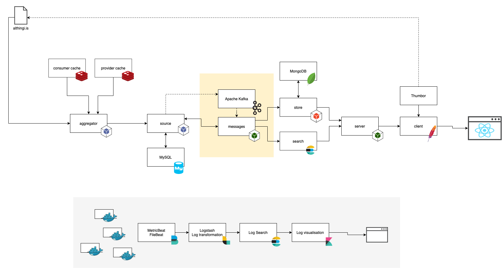
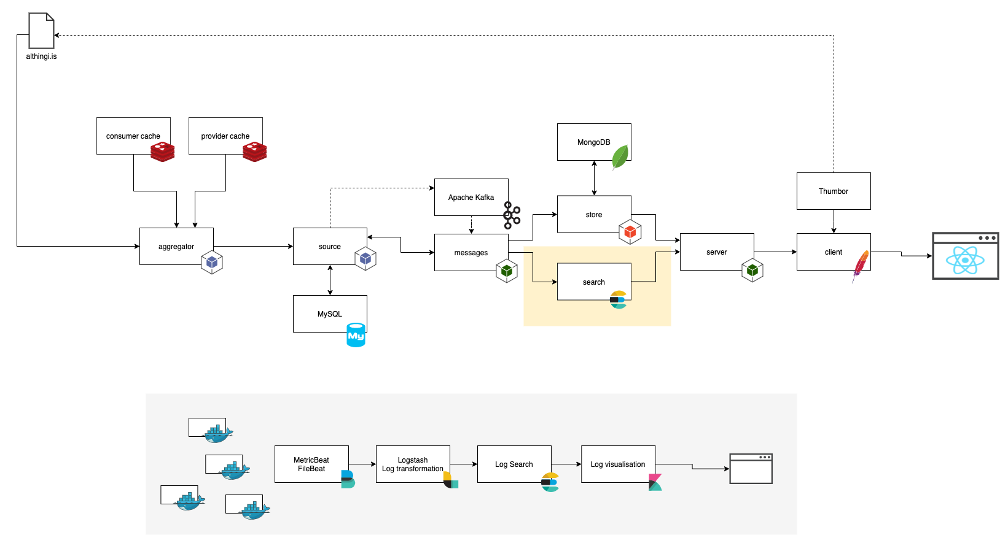
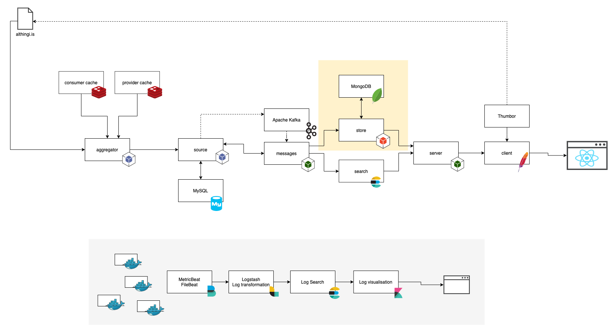

## The system's components.

### Aggregate

The [aggregator](https://github.com/fizk/althingi-aggregator) system is responsible for fetching data from [althingi.is](althingi.is).

It is a PHP application that is run like a CLI tool. It will pass formatted data onto the **Source**. It is dependent on (Redis) caching servers.

### Source

The [source](https://github.com/fizk/althingi-source) system is the single-source-of-truth for all data. It is fed data from the **Aggregator**. The role of this system is to keep data integrity and provide an API for any downstream system interested in formated and validated althingi.is data.

It is a PHP application running behind an Apache HTTP server. It used MySQL as its data-storage. It has a built-in event system (event-driven-architecture) that will notify a broker (Apache Kafka) about any changes to its data-structure. The **Messages** is listening for these changes.

```sh
docker compose up source
```

It is also possible to instruct this system to (re)broadcast events. This can come in handy if you already have all the data in this system, but your **Store** is empty. All downstream systems (Message, Store) need to be running as well. To get a list of all available commands, run:
```sh
docker compose run --rm source index console
```
To index all congressmen in a give assembly, for example, run:
```sh
docker compose run --rm source index console:congressman --assembly_id=145
```

### Messages

The [messages](https://github.com/fizk/althingi-messages) is listening for changes in the **Source**. When changes are detected, this system will evaluate the changes and could go back to **The Source** for additional information.

This system is fronted by a message-broker (Apache Kafka) that is listening for events from **The Source**, When a message is received, a Deno/TypeScript application will encode the message. It can go back to **The Source** for additional information before it relays the data to **The Store** or other systems. (Elasticsearch and Notification service are in the pipeline).

```sh
docker compose up zookeeper kafka
```

### Search

TBC

### Store

The [store](https://github.com/fizk/althingi-store) is responsible for maintaining a de-normalized/aggregated version of data stored in **The Store**. Its role is to contain computed values/data-structures for fast delivery.

This system is a Java SpringBoot web application. It uses MongoDB as its data-store. It gets its data from **The Messages**.

```sh
docker compose up store
```

### Client/Server

The [client/server](https://github.com/fizk/althingi-app) are two systems in one repo. Firstly, **The server** is a Deno/TypeScript application that sources data fom **The Store** and makes is available through a GraphQL API. In the future, this service will also source data from an Elasticsearch service.

Secondly, **The Client** is an Apache HTTP server that serves static assets such as JS, CSS and other assets to a web-browser. It also works as a reverse-proxy and behinds the sense sources cropped images from a Thumbor image server as well as relaying all graph-ql requests to **The Server**. It does everything a production-ready HTTP server would do like: gzip all assets, provides HTTPS/HTTP2 access etc...

```sh
docker compose up client server
```

### Monitor/Log
[Logging and monitoring](https://github.com/fizk/althingi-monitor) is done by the ELK stack.
**Filebeat** and **Metribeat** are listening to all running Docker Containers. It will feed `stdout` and `system-logs` into **Logstash**, which will format the stream before handing it over to **Elasticsearch**. Monitoring the logs is done through the **Kibana** interface.


There is a little bit of setup involved.

#### First.
All the containers need to be started

```sh
docker compose -f ./docker-compose.yaml up -d \
    elasticsearch kibana metricbeat filebeat logstash
```

#### Next.
Metricbeat needs to create all required indexes and dashboards in Elasicseach/Kibana. (This might take a few minutes)

```sh
docker compose run metricbeat bash -c "metricbeat setup -E setup.kibana.host=kibana:5601 -E output.elasticsearch.hosts=[\"elasticsearch:9200\"]"
```

#### Last.
Indexes need to be initialized for system logging and monitoring

```sh
docker compose run search-init
```

Now everything should be set up and ready. Go to [localhost:8081](http://localhost:8081) to gain access to Kibana.

**Note**: If you are initializing indexes for the first time, you might get a `404` error saying that the index doesn't exist. That's OK, the script is trying to delete the old index template and create a new. Since this is you first time running the script, the old index template won't exist, but a new template will still be created.


## Running the system.
You can run the system locally

```sh
docker compose -f ./docker-compose.yaml up \
    source store messages client server -d
```

By default the docker-compose file does not expose any ports (except for the 80 port for Apache). While running this on a local machine for educational purposes, it is good to be able to poke into different services. For that, this repo provides an overwrite `docker-compose.ports.yaml` file that exposes all the default ports. Simply add a reference to it when starting the containers.

```sh
docker compose -f ./docker-compose.yaml -f docker-compose.ports.yaml up \
    source store messages client server -d
```

| service   | port         | description                       |
| --------- | ------------ | --------------------------------- |
| source    | 8082         | The single source of truth API    |
| source-db | 3306         | MySQL database powering `source`  |
| store     | 8083         | The aggregated datasource         |
| store-db  | 27017        | MongoDB powering `store`          |
| client    | 80           | Apache                            |
| server    | 8084         | GraphQL server                    |
| queue     | 15672        | RabbitMQ dashboard                |

Now that the system is running, start the monitoring

```sh
docker compose -f ./docker-compose.yaml up \
    elasticsearch kibana metricbeat filebeat logstash -d
```
Consult the section above get initialize the monitor system.

The `docker-compose.ports.yaml` file can be used to expose ports.

```sh
docker compose -f ./docker-compose.yaml  -f docker-compose.ports.yaml up \
    elasticsearch kibana metricbeat filebeat logstash -d
```

| service          | port     | description                  |
| ---------------- | -------- | ---------------------------- |
| elasticsearch    | 9200     | The Elasticsearch cluster    |
| kibana           | 8081     | Kibana dashboard             |
| metricbeat       | -        | no port available            |
| filebeat         | -        | no port available            |
| logstash         | -        | no port available            |


## Fetching data
The [aggregator](https://github.com/fizk/althingi-aggregator) is used to fetch data. First run the `globals` script, it will fetch all required entries that are needed for individual assembly, but span across multiple assemblies: like committees, categories etc...

Next fetch all `members`. This ensures that all congressmen are present.

Lastly fetch the `assembly`.

```sh
docker compose run --rm aggregator globals
docker compose run --rm aggregator members
docker compose run --rm aggregator assembly 151
```

## Clear cache.
When data is fetched from `althingi.is`, the entries are cached. If so required, the cache an be cleared by running:

```sh
docker exec -it althingi-aggregator-cache-consumer redis-cli FLUSHALL
docker exec -it althingi-aggregator-cache-provider redis-cli FLUSHALL
```

## CI/CD
This repo contains the `scripts` directory. It contains scripts to stop a container, pull the latest version of this container and then start it up again.

This is used in the CI/CD pipeline. Each service has its own script file which can be run, provided with the latest **tag** for a given service.